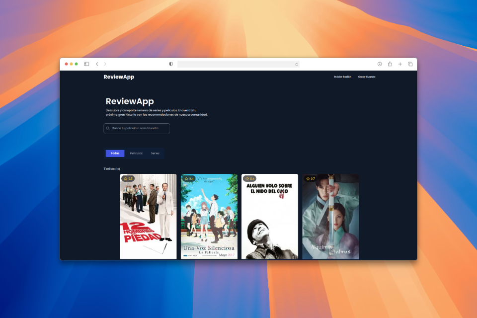
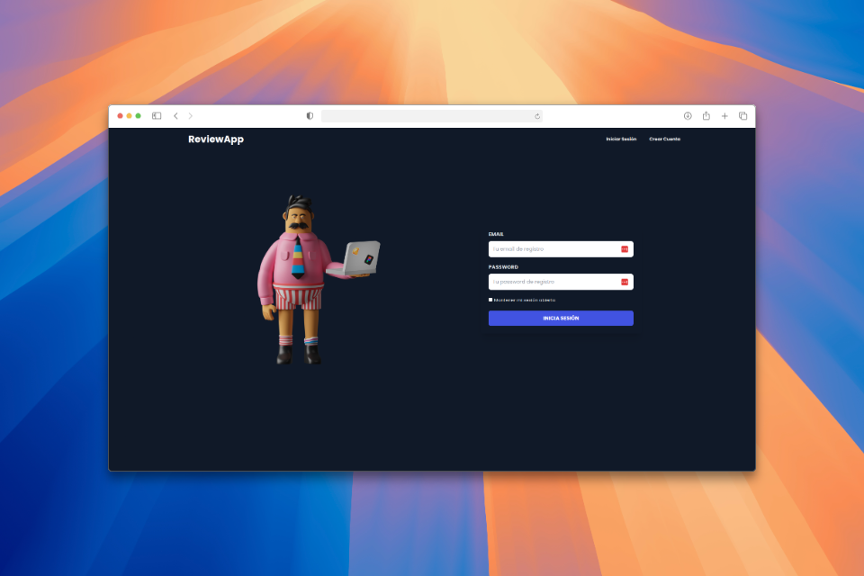
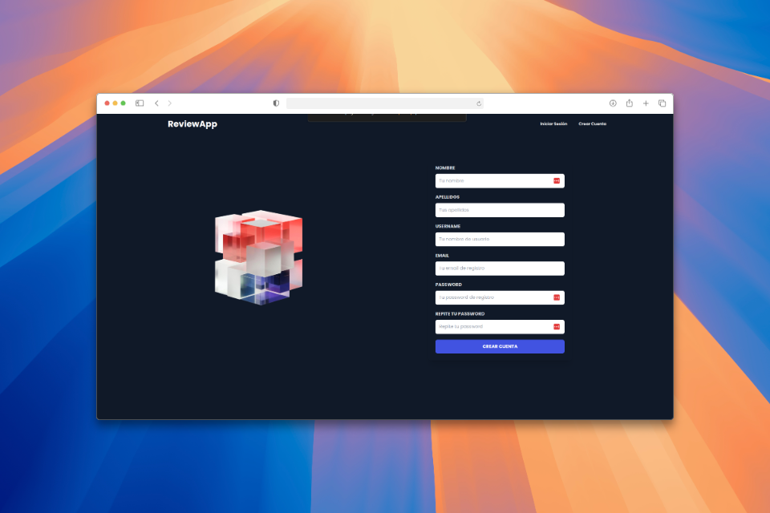
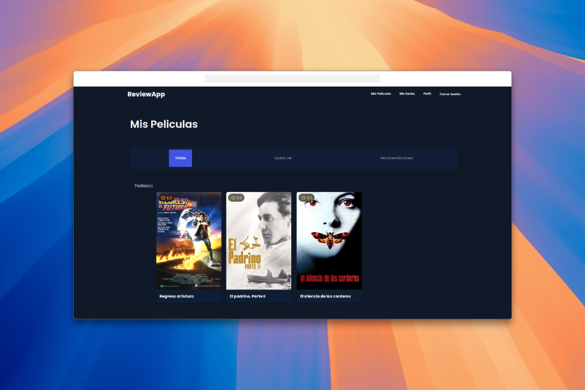
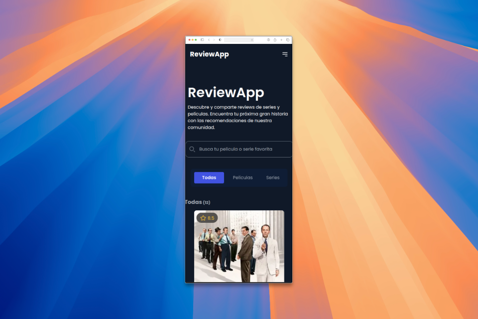
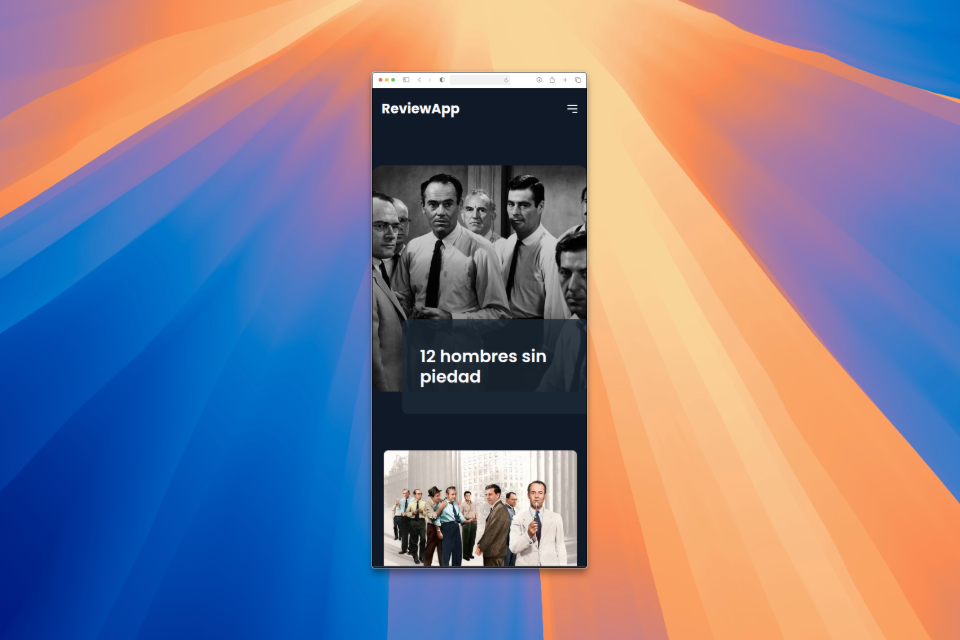
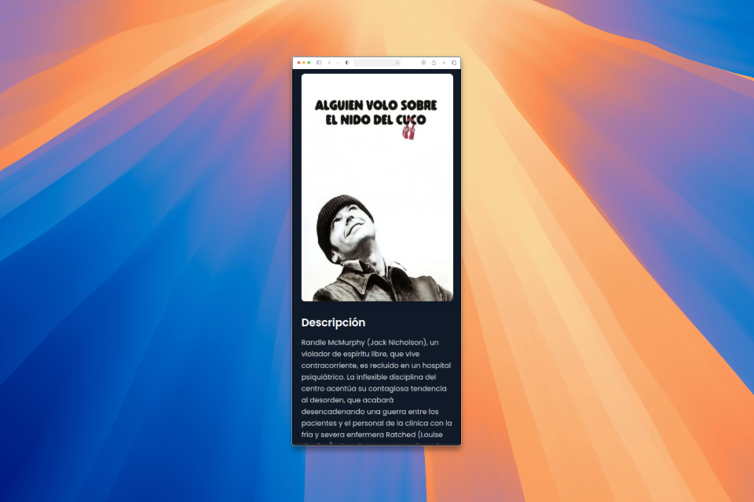

<p align="center"><a href="https://laravel.com" target="_blank"></a></p>


# ReviewApp en Laravel

ReviewApp es una aplicación web desarrollada con Laravel y Livewire que permite a los usuarios registrarse, gestionar sus películas vistas y pendientes, y organizar fácilmente las que desean ver.

## Requisitos

- <a href="https://www.docker.com/" target="_blank">Docker</a>
- <a href="https://docs.docker.com/compose/" target="_blank">Docker Compose</a>

## Instalación

1. Clona el repositorio en tu máquina local:
    ```{bash}
   git clone https://github.com/danirodriguezz/ReviewApp.git
    ```
2. Navega hasta el directorio del proyecto
   
    ```{bash}
    cd ReviewApp
    ```
3. Copia el archivo de configuración de ejemplo y configuralo segun tus preferencias

    ```{bash}
   cp .env.example .env
    ```
4. Ejecuta el entorno de desarrollo con Docker Compose
   
    ```{bash}
   ./vendor/bin/sail up -d
    ```
5. Genera una clave de aplicación
   
    ```{bash}
    ./vendor/bin/sail artisan key:generate
    ```
6. Ejecuta las migraciones de la base de datos:

    ```{bash}
    ./vendor/bin/sail artisan migrate
    ```

7. Visita http://localhost en tu navegador para ver la aplicación ReviewApp.

## Uso

1. Registrate en la aplicación creando un nuevo usuario
2. Busca peliculas que hayas visto o quieras ver
4. Añadelas a visto o quiero ver

## Mockups de Ordenador










## Mockups de Movil





